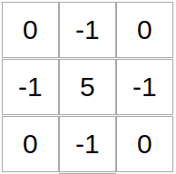
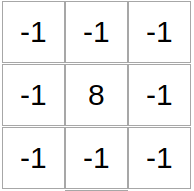
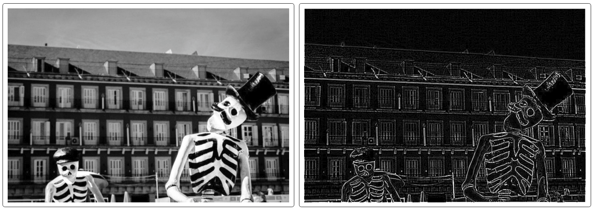

# ImFx
Perform client-side image processing algorithms like:
- Spatial domain filtering
- Bit-plane slicing

Check out [the demo](https://mebble.github.io/imfx/).

## What it does
- Takes an image
- Takes a kernel
- Applies kernel convolution on the image
- Displays the output

## What it looks like

*The kernel for image sharpening*

*The kernel for edge detection*

*Sharpening an image of a cat in a hat* *(Source: [Photo by rawpixel.com from Pexels](https://www.pexels.com/photo/grey-chartreaux-cat-with-red-and-white-party-hat-and-licking-nose-1663417/))*

*Edge Detection on an image of skeletons on the street* *(Source: [Photo by Iván Rivero from Pexels](https://www.pexels.com/photo/monochrome-photo-of-two-skeleton-wearing-hats-1599469/))*

## TODOs
- [x] Choose updatable kernel from templates
- [x] Choose from a selection of images
- [x] Split and process image across 4 workers
- [ ] Log the time taken to process image. Can log the time taken separately for each worker
- [ ] Implement more image processing stuff:
    * [ ] min/max/median filters
    * [ ] Separable filters for faster convolution
    * [ ] Bit-plane slicing
- [ ] Use WebGL for fast processing in each worker
- [ ] Upload image from device
- [ ] Take camera photo and use image
- [ ] Download output to device
- [ ] Allow use of 5x5 kernels
- [ ] Use native canvas api instead of p5
- [ ] populate the pixels of the result image as they return from the web worker
- [ ] use rxjs
- [ ] floyd-steinberg dithering and other codingtrain challenges
